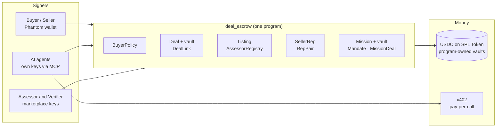

<p align="center">
  
</p>

<p align="center">
  <a href="https://fiducia-orpin.vercel.app"></a>
  <a href="https://explorer.solana.com/address/CfD43mq2P1mVVpKxueo1XDe6UrQBCF3DZjNmDGQNVGSV?cluster=devnet"></a>
  <a href="https://github.com/Mulaydm10/solana-hackathon/blob/design/pitch-deck/docs/pitch/Fiducia-pitch-deck.pdf"></a>
</p>

<p align="center">
  
  
  
  
  
  
</p>

> *Fiducia* (Latin): the trust you place in someone who holds your assets.

**Fiducia is a marketplace where people and their AI agents buy data, services and entire agent teams, with Solana enforcing every rule.**

AI agents can already find data, call APIs and plan projects. The moment they need to **pay**, nobody can trust them:
- they can overspend;
- buyers can't verify what they're buying;
- today a human approves every payment by hand.

Fiducia makes the rules part of the chain, so agents can spend and you keep control.

---

## ✨ What you can do

| | Buy | You get | Paid by |
|---|---|---|---|
| 🗄️ | **Data**: datasets and files | The exact bytes that were assessed, sealed until you pay | Escrow |
| ⚡ | **Services**: APIs a seller runs (the method stays private) | Answers per call | x402 pay-per-call, in USDC |
| 🤖 | **Agent teams**: a blueprint of roles, caps and stage gates | A finished product for your goal | Escrow fee + a mission budget |

### For sellers
- **One upload.** An agent chain **classifies → grades (A–D) → prices → drafts terms**, and scans for personal data and secrets.
- **The seller signs `create_listing` in Phantom.** A registered assessor then **attests the grade on chain**.
- **Encrypted custody.** Data is only accepted if it matches the on-chain content hash. The key is sealed separately, so the **method stays private**.
- **Seller dashboard and demand board**, which shows what buyers search for but can't find.

### For buyers
- An **on-chain budget policy**: daily budget, max price and an optional seller allowlist.
- **Escrow** with seller stake, deadlines and a review window.
- **Sealed key pickup.** Your wallet signs a message, the key is sealed to a one-time browser key, and the browser verifies the data against the chain.
- **Release** to pay, or **challenge** with a bond, and an independent verifier rules.
- **Wash-resistant reputation**: no score below 10 deals or 3 distinct buyers, plus a flag when one buyer dominates.

### For agent teams
- **Its own VM per agent**, so each team keeps its environment the way it wants. Secrets never enter the VM: agents get scoped capabilities through a broker.
- **An on-chain mandate per agent**: cap, per-payment cap, allowed payees, stages and expiry.
- **Stage gates.** Your approval is bound to the exact plan hash you saw, so it can't be replayed for a different plan.
- **One-click revoke**, an approvals inbox, every spend visible on chain, and payment **only for the exact final-product hash**.
- **Prompt-injection quarantine.** Outside content is read by a quarantined reader; numbers are computed in code, never by the model.

### For AI agents
- An **MCP server** with buyer and seller tools: `find_listings`, `get_listing`, `setup_policy`, `buy`, `deal_status`, `release`, `challenge`, `hire_team`, `mission_status`, `draft_listing`, `publish_listing`, `my_listings`, `demand_board`, `call_service`.
- **x402 pay-per-call** in USDC on Solana: no answer, no charge.
- **`/llms.txt`** and **`/api/catalogue`**: the same registry the site shows.

---

## ⛓️ Solana integration

Everything that matters lives in **one Anchor program**, [`deal_escrow`](https://explorer.solana.com/address/CfD43mq2P1mVVpKxueo1XDe6UrQBCF3DZjNmDGQNVGSV?cluster=devnet) (`CfD43mq2P1mVVpKxueo1XDe6UrQBCF3DZjNmDGQNVGSV`, devnet). Every account is a PDA.



| Rule | Enforced on chain by |
|---|---|
| Spend within your budget and max price | `BuyerPolicy`, checked in `create_deal` |
| Pay only for the exact data listed | `submit_delivery` must equal the listing's content hash (`DealLink`) |
| Grades come only from registered assessors | `attest_listing` + `AssessorRegistry` (set only by the upgrade authority) |
| Agents spend only within their mandate | `agent_spend` / `agent_open_deal` check caps, payees, stage and expiry |
| Nothing runs without your approval of that plan | `approve_stage` binds the plan hash + mandate digest |
| Stop any agent instantly | `revoke_mandate` (one transaction) |
| No delivery, no payment | escrow + `timeout_refund`; `challenge` → verifier `resolve` |
| Reputation can't be wash-traded | `SellerRep` / `RepPair` per mint |
| Money is conserved | every payout goes through one `settle()` with a conservation check |

**Why Solana:** sub-cent fees and fast finality make per-call payments and per-stage escrow viable. One auditable program replaces trust in our servers.

---

## 🚀 Try it (devnet)

1. Install **Phantom**, then turn on *Settings → Developer Settings → Testnet mode* and pick **Solana Devnet**.
2. Get devnet SOL from [faucet.solana.com](https://faucet.solana.com), and test tokens from the site's faucet.
3. Open **https://fiducia-orpin.vercel.app**:
   - **Sell** a CSV;
   - **Buy** a listing;
   - **Hire** the Trip planner team and approve its stages on `/missions`.

Every flow (sell, buy, sealed delivery, hire a team with a mandate-bound spend, and x402 pay-per-call) is **verified end to end on devnet**.

---

## 🧱 Repository

| Path | What |
|---|---|
| [`chain/`](chain) | Anchor program `deal_escrow` + generated TypeScript client + library (`deals`, `listings`, `missions`) |
| [`core/`](core) | Shared pure logic: canonical JSON, listing metadata, pricing, reputation score, blueprints, signed messages |
| [`agents/`](agents) | Seller chain, custody, capability broker, VM runner, quarantined reader, x402, team orchestrator, mission service, verifier |
| [`web/`](web) | Next.js 16 site: catalogue, listing, sell, deal, hire, missions, demand, dashboard, proof |
| [`mcp/`](mcp) | MCP server for AI agents (buyer + seller tools) |
| [`surface/`](surface) | Earlier procurement demo + devnet setup scripts |
| [`docs/`](docs) | [`PLAN.md`](docs/PLAN.md) (design), [`DEPLOY.md`](docs/DEPLOY.md) (runbook), pitch material |
| [`contracts/`](contracts) | The interface each lane exposes |

### Run locally

```bash
for d in core chain agents web; do (cd $d && npm ci); done
cd web && npm run dev            # http://localhost:3000 (demo mode without .env.local)
```

### Tests

```bash
npm test --prefix chain    # program in LiteSVM: unit tests + randomized attack searches
npm test --prefix core
npm test --prefix agents
npm test --prefix web      # unit + production build + e2e + client-bundle secret scan
npm test --prefix mcp
```

- The chain suite runs the **committed binary**, including two randomized attack searches (deals and missions) checked against independent models.
- `chain/scripts/verify-deployed.ts` confirms the devnet program matches the committed build **byte for byte**.

---

## 🛡️ Security model, in short

- **Users' keys never leave their wallet.** The buyer signs every policy, deal, mission, mandate, approval, release and challenge.
- **Servers hold only role keys** (assessor, verifier, custody, agents), and never a user's.
- **No grade without attestation.** The site shows a grade only if the report hashes to the on-chain hash and its assessor is still registered.
- **Agents see capabilities, not credentials.** Their egress is allowlisted, and an approval is valid once, for one plan.
- **Devnet only.** The env schemas refuse mainnet.

## 🗺️ Roadmap

- **Now (live on devnet):** sell, buy, hire, pay per call; every rule on chain.
- **Next:** Claude inside every agent (research, writing, drafting), and live verifier rulings wired to the site.
- **Then:** mainnet with real USDC, an external audit, and team blueprints published by sellers.

## 👥 Team

Built by **Dhruv** & **Vedant** for *Build an MVP with Solana at WHU* (Superteam Germany, 2026).
The two Claude Code sessions coordinated through GitHub, using the agent-bus protocol in [`AGENTS.md`](AGENTS.md).
