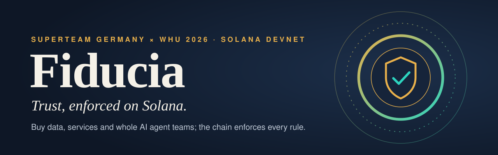
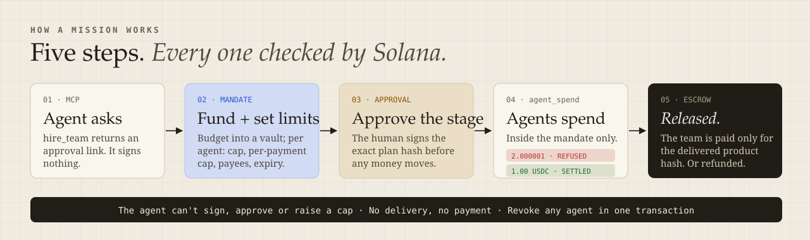
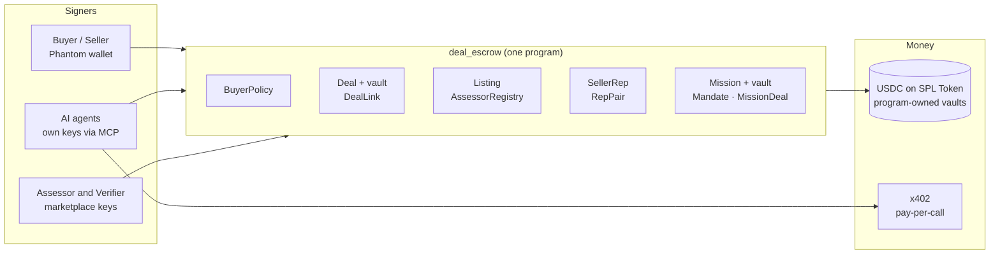

<p align="center">
  
</p>

<p align="center">
  <a href="https://fiducia-orpin.vercel.app"></a>
  <a href="https://explorer.solana.com/address/CfD43mq2P1mVVpKxueo1XDe6UrQBCF3DZjNmDGQNVGSV?cluster=devnet"></a>
  <a href="https://youtu.be/L7-ofBtbwRA"></a>
  <a href="docs/pitch/Fiducia-pitch-deck.pdf"></a>
  <a href="docs/pitch/Fiducia-Technical-Brief.pdf"></a>
  <a href="docs/pitch/Fiducia-GTM-Launch-Plan.pdf"></a>
</p>

<p align="center">
  
  
  
  
  
  
</p>

> *Fiducia* (Latin): the trust you place in someone who holds your assets.

**Fiducia controls how AI agents spend money.** Agents buy data, APIs, reports and specialist work inside an **on-chain mandate**: caps, approved sellers, stages and expiry, enforced by one Solana program. A human approves every stage, and the seller is paid only for what was delivered.

| | |
|---|---|
| **Built first for** | Small AI product teams and automation agencies whose **research agents** buy datasets, APIs, reports and expert work for clients |
| **Their problem** | Someone answers to a client for every dollar an agent spends. Today that means shared API keys, a company card and a spreadsheet |
| **With Fiducia** | One mandate per client, approved sellers only, every stage signed off by a human, every receipt on chain |
| **Sellers** | Data owners, API makers, researchers, and developers or architects selling agent teams, designs and specialist work |

---

## ⚡ Start here: pick a path

| | Path | Time | What you need |
|---|---|---|---|
| **1** | [**Click the demo**](#1-click-the-demo-no-wallet) | 1 min | A browser. No wallet |
| **2** | [**Use it from Claude Code (MCP)**](#2-use-it-from-claude-code-mcp) | 5 min | Node 20+, Claude Code or Claude Desktop |
| **3** | [**Use it with your own wallet**](#3-use-it-with-your-own-wallet) | 5 min | Phantom on devnet |
| **4** | [**Run it locally**](#4-run-it-locally) | 5 min | Node 20+ |

### 1. Click the demo (no wallet)

1. Open **[fiducia-orpin.vercel.app/hire](https://fiducia-orpin.vercel.app/hire)** and press **Try the demo**. A capped devnet demo buyer signs for you.
2. On the mission page, press **Approve** for stage 1. Watch the researcher's 2.000001 USDC payment get **refused** by the chain (`OverPerTxCap`) and its 1 USDC payment **settle**.
3. Approve stage 2, read the delivered plan and its hash, then press **Release**. Every step links to Solana Explorer.

> Demo agents are labelled **Simulated AI demo**: deterministic, so every run is repeatable. The approvals, payments, refusal and release are real devnet transactions.

### 2. Use it from Claude Code (MCP)

```bash
git clone https://github.com/Mulaydm10/solana-hackathon && cd solana-hackathon
for d in core chain agents mcp; do (cd $d && npm ci); done
npm run build --prefix mcp                                   # -> mcp/dist/cli.js
solana-keygen new -o ~/.config/fiducia/agent.json --no-bip39-passphrase   # the agent's OWN devnet key

claude mcp add fiducia \
  -e DEAL_KEYPAIR=$HOME/.config/fiducia/agent.json \
  -e DEAL_SITE_URL=https://fiducia-orpin.vercel.app \
  -e DEAL_ASSESSOR=EvR4wU8jfNeRLwHiDv8DoCqkSJ8w8nWwhQEXUg95PyKY \
  -- node "$PWD/mcp/dist/cli.js"
```

Then ask Claude:

> *Find an agent team that plans trips and hire it to plan 3 days in Lisbon for two, mid-range, with a 4 USDC budget.*

Claude calls `find_listings`, then `hire_team`, and returns an approval link. **No tool signs anything in that step:** funding, mandates and stage approvals stay with the human. Claude Desktop config, all variables and a scripted run: [`mcp/README.md`](mcp/README.md#run-it-for-the-demo-devnet-today).

<details>
<summary><b>All 17 MCP tools</b></summary>

| Tool | Signs | What it does |
|---|---|---|
| `program_info` | no | Program id, network, deal statuses, refusal codes |
| `my_wallet` | no | The agent's address, SOL, USDC, spending policy and next step |
| `get_test_funds` | no (devnet) | Devnet SOL and test USDC for the agent's own wallet |
| `find_listings` / `get_listing` | no | Search the marketplace; one listing with price, hash, attestation and reputation |
| `setup_policy` | yes | The agent's on-chain spending policy (daily budget, max price) |
| `buy` / `deal_status` | yes / no | Buy an attested listing under escrow; follow the deal |
| `release` / `challenge` | yes | Pay for a checked delivery, or dispute it with the verifier |
| `hire_team` / `mission_status` | no | Approval link for a human to fund a team; follow the mission |
| `call_service` | yes | x402 pay-per-call: no answer, no charge |
| `draft_listing` / `publish_listing` / `my_listings` | yes | Sell from an agent |
| `demand_board` | no | What buyers search for but cannot find |

</details>

### 3. Use it with your own wallet

1. Install **Phantom**, turn on *Settings → Developer Settings → Testnet mode* and pick **Solana Devnet**.
2. Get devnet SOL from [faucet.solana.com](https://faucet.solana.com) and test USDC from the site's faucet.
3. On **[fiducia-orpin.vercel.app](https://fiducia-orpin.vercel.app)**: **Sell** a CSV, **Buy** a listing, or **Hire** a team and approve its stages on `/missions`.

### 4. Run it locally

```bash
for d in core chain agents web; do (cd $d && npm ci); done
cd web && npm run dev            # http://localhost:3000 (demo mode without .env.local)
```

---

## 🧭 How it works

<p align="center"></p>

### One real mission, on chain

A clean devnet run of the hire flow: mission [`BJyjL2qc…`](https://explorer.solana.com/address/BJyjL2qc9bfdxB8K8a7fyaxbhKyovNeapvW7wbsj1rSs?cluster=devnet), fee deal [`CSYUV9i8…`](https://explorer.solana.com/address/CSYUV9i8cZDxhfgtevd2m7bUmwVcqfZuC8CQCTQAVzZA?cluster=devnet).

| Step | On chain | Result |
|---|---|---|
| Human funds the mission and adds two mandates | researcher 3.00 USDC (2.00 per payment), writer 1.00 USDC | ✅ |
| Human approves stage 1 | `approve_stage` bound to the plan hash | ✅ approved |
| Researcher tries to pay 2.000001 USDC | `agent_spend` → `OverPerTxCap` | ⛔ refused, never lands |
| Researcher pays 1.00 USDC to the approved seller | `agent_spend` | ✅ settled |
| Human approves stage 2, team delivers | `approve_stage`, `submit_delivery` (product hash) | ✅ delivered |
| Human releases the fee | `release` | ✅ paid |

---

## ✨ What you can do

| | Buy | You get | Paid by |
|---|---|---|---|
| 🗄️ | **Data**: datasets and files | The exact bytes that were assessed, sealed until you pay | Escrow |
| ⚡ | **Services**: APIs a seller runs (the method stays private) | Answers per call | x402 pay-per-call, in USDC |
| 🤖 | **Agent teams**: a blueprint of roles, caps and stage gates | A finished product for your goal | Escrow fee + a mission budget |

<details>
<summary><b>For sellers, buyers, agent teams and AI agents</b></summary>

**Sellers**
- **One upload.** An agent chain **classifies → grades (A to D) → prices → drafts terms**, and scans for personal data and secrets.
- **The seller signs `create_listing` in Phantom.** A registered assessor then **attests the grade on chain**.
- **Encrypted custody.** Data is accepted only if it matches the on-chain content hash; the key is sealed separately, so the **method stays private**.
- **Seller dashboard and demand board.**

**Buyers**
- An **on-chain budget policy**: daily budget, max price and an optional seller allowlist.
- **Escrow** with seller stake, deadlines and a review window.
- **Sealed key pickup**: the browser verifies the data against the chain.
- **Release** to pay, or **challenge** with a bond, and an independent verifier rules.
- **Wash-resistant reputation**: no score below 10 deals or 3 distinct buyers, and a flag when one buyer is over half the volume.

**Agent teams**
- **Its own VM per agent.** Secrets never enter the VM: agents get scoped capabilities through a broker.
- **An on-chain mandate per agent**: cap, per-payment cap, allowed payees, stages and expiry.
- **Stage gates** bound to the exact plan hash, so an approval can't be replayed for a different plan.
- **One-click revoke**, an approvals inbox, and payment **only for the exact final-product hash**.
- **Prompt-injection quarantine**: outside content goes through a quarantined reader; numbers are computed in code, never by the model.

**AI agents**
- The **MCP server** above, **x402 pay-per-call** in USDC on Solana, and **`/llms.txt`** + **`/api/catalogue`**.

</details>

---

## 🔌 Machine economy (peaq track)

> **Two machines, one deal: a delivery robot pays a charging pad, settled on chain, with no human per payment.**
> Both machines are **simulated**. Their Solana transactions are real (devnet), and their peaq identities and events are real (agung testnet).

**The loop: "charge on delivery."**
1. **The owner sets the rules once, on chain:** a Fiducia mandate for the robot's agent. At most **0.50 USDC per charge** and **2 USDC in total**, and the charging pad is the **only allowed payee**.
2. **The robot decides when it needs to charge** (simulated battery) **and pays on its own.** Its agent opens an escrow deal for each charge. Nobody approves individual payments. The robot is on a schedule: every 30 minutes, it checks its battery and, if below 25%, decides how much to charge (up to 80%, capped by its mandate).
3. **Pay only for proven energy.** The pad signs a meter reading (kWh, time, price). Its sha256 is delivered on chain, and the robot releases **exactly that reading**.
4. **The program enforces the limits.** A 0.60 USDC charge is refused by the Solana program (`OverPerTxCap`). The site simulates every transaction first, so a refused charge is never sent.
5. **It's recorded on peaq.** Each settled charge becomes a **revenue event for the pad** and an **activity event for the robot** in peaq's EventRegistry. That's the history peaq's Machine Credit Rating is built from.

**Why both chains:** peaq is the machines' identity and credit layer. Solana + Fiducia is the money layer: mandates, escrow and settlement. peaq's own agent-spending limits are enforced by its orchestrator server; Fiducia enforces the same kind of limits **in a Solana program**.

**Why this is DePIN:** The charging pad is one node of a charging network. It has a peaq machine identity, earns revenue for a service it proves (a signed kWh meter reading, hashed on chain), and builds the on-chain revenue history that peaq's Machine Credit Rating and future financing are built from. One simulated pad today; next is many pads and real meters. The same loop also fits a drone landing on a charging pad—peaq's own starter idea for the DePIN track—though nothing drone-specific is built yet. Autonomous ticking (the robot deciding on its own) is being switched on in production.

| Try it | |
|---|---|
| Status | **Live on 7 Oct 2026.** peaq network: **agung testnet**. Robot = peaq machine **348**, charging pad = peaq machine **349** (registered and bonded in agung's 1.0 IdentityRegistry) |
| First settled charge | 0.40 USDC, released: [`5t4Vbigi…ASBLU`](https://explorer.solana.com/tx/5t4VbigiwYughjqXP36Df17mu5dm5jtEnnLBKBuBjjckopg18kgLxPgjMVUpQWfFDNmu1aoUmuK7X8oicv9ASBLU?cluster=devnet) · pad revenue event [`0xb07adf…8ba8`](https://agung-testnet.subscan.io/tx/0xb07adfadda4142efa034bb38afeef76f7c5a3f6fa6a6783385c3308814ed8ba8) · robot activity event [`0xa61322…36da`](https://agung-testnet.subscan.io/tx/0xa61322813844c0d19f031756ec1693fe393e4cd1c2e0b9498b528df11ade36da) |
| Refused charge | 0.60 USDC: refused by the program (`OverPerTxCap`) in simulation; nothing was sent |
| Live page | https://fiducia-orpin.vercel.app/machines: "Charge 0.40 USDC", then "Try 0.60 USDC (over limit)" |
| From Claude Code | MCP tool `machine_status`: machine IDs, mandate left, last charges with their Solana and peaq transactions |
| Fleet mission (devnet) | [`7hTQTkkZ…ssYn6`](https://explorer.solana.com/address/7hTQTkkZ5hGrVvdsGXm3kqG4RB3u7LiN62WdmUDssYn6?cluster=devnet), live until 27 Oct 2026 |
| peaq network | agung testnet (chain 9990), EventRegistry [`0x2DAD…0040`](https://agung-testnet.subscan.io/account/0x2DAD8905380993940e340C5cE6d313d5c2780040) |

**Honest limits**
- **Simulated machines.** No physical robot or pad. Battery and driving are simulated. The keys, signatures, deals and events are real.
- **Self-reported peaq events (trust level 0).** peaq can't verify a Solana transaction (its event registry accepts peaq or Base as source chains), so each event carries the full Solana release signature for anyone to check on the Solana Explorer. The events never claim peaq verified the payment.
- **agung uses peaq's 1.0 machine registry.** agung has no Economics 2.0 event registry, so the robot and pad are registered and bonded (1 PEAQ each) in agung's 1.0 IdentityRegistry. peaq serves no credit rating for testnet machines, and the page says so instead of showing a number.
- **Test money only:** devnet test USDC and agung PEAQ.

Code: `agents/src/machines/` (meter reading, charge loop, peaq events), `agents/scripts/machines/` (one-time setup), `web/app/machines/` (page and API), `mcp/src/tools/machine_status.ts`. Plan: [`docs/handoffs/peaq-machine-economy.md`](docs/handoffs/peaq-machine-economy.md).

---

## ⛓️ Solana integration

Everything that matters lives in **one Anchor program**, [`deal_escrow`](https://explorer.solana.com/address/CfD43mq2P1mVVpKxueo1XDe6UrQBCF3DZjNmDGQNVGSV?cluster=devnet) (`CfD43mq2P1mVVpKxueo1XDe6UrQBCF3DZjNmDGQNVGSV`, devnet). Every account is a PDA.



| Rule | Enforced on chain by |
|---|---|
| Spend within your budget and max price | `BuyerPolicy`, checked in `create_deal` |
| Pay only for the exact data listed | `submit_delivery` must equal the listing's content hash (`DealLink`) |
| Grades come only from registered assessors | `attest_listing` + `AssessorRegistry` (set only by the upgrade authority) |
| Agents spend only within their mandate | `agent_spend` / `agent_open_deal`: per-payment cap, mandate cap, stage cap, mission budget, payees, stage, expiry |
| Nothing runs without your approval of that plan | `approve_stage` binds the plan hash + mandate digest |
| Stop any agent instantly | `revoke_mandate` (one transaction) |
| No delivery, no payment | escrow + `timeout_refund`; `challenge` → verifier `resolve` |
| Reputation can't be wash-traded | `SellerRep` / `RepPair` per mint |
| Money is conserved | every payout goes through one `settle()` with a conservation check |

**Why Solana:** a median fee under a tenth of a cent makes per-call payments and per-stage escrow viable, where a card fee (about 2.9% + $0.30) would be larger than a 5 cent data call. One auditable program replaces trust in our servers.

---

## 📚 Docs and pitch

| Document | What's inside |
|---|---|
| [**Pitch deck**](docs/pitch/Fiducia-pitch-deck.pdf) | 15 slides: problem, first customer, solution, Solana integration, devnet proof, go-to-market, business model, roadmap |
| [**Technical brief**](docs/pitch/Fiducia-Technical-Brief.pdf) | 3 pages: system map and trust boundaries, mission lifecycle, spend checks, account model, threats, status, roadmap |
| [**Go-to-market and launch plan**](docs/pitch/Fiducia-GTM-Launch-Plan.pdf) | 8 pages: why now (cited data), customer and vertical, marketplace, pricing hypothesis, launch phases, metrics, risks |
| [`docs/PLAN.md`](docs/PLAN.md) · [`docs/DEPLOY.md`](docs/DEPLOY.md) · [`docs/ARCHITECTURE.md`](docs/ARCHITECTURE.md) | Design, deploy runbook, architecture |

> Market figures in the pitch material are external context, not Fiducia traction. Pricing and launch numbers are hypotheses and targets.

---

## 📍 Deployment

| | |
|---|---|
| Network | **Solana devnet** (mainnet is refused by the MCP server and not deployed) |
| Program `deal_escrow` | [`CfD43mq2P1mVVpKxueo1XDe6UrQBCF3DZjNmDGQNVGSV`](https://explorer.solana.com/address/CfD43mq2P1mVVpKxueo1XDe6UrQBCF3DZjNmDGQNVGSV?cluster=devnet) |
| v3 upgrade transaction | [`2i7r7iCz…HBanQuwC3`](https://explorer.solana.com/tx/2i7r7iCz3CkrYfcuvTVUd3cpxEm7GveWqYNtiiEG3guBkjAGcdQPnsQyUi3W7RsW6sYvR2fqRNqiWKHHBanQuwC3?cluster=devnet) (slot 507459446) |
| Deployed binary | sha256 `d437551261d8a438b41b9e0ecc60994ccc9db4df3cfbeab322b226c31b1f7e8c`; `chain/scripts/verify-deployed.ts` checks it against the committed build |
| Registered assessor | [`EvR4wU8jfNeRLwHiDv8DoCqkSJ8w8nWwhQEXUg95PyKY`](https://explorer.solana.com/address/EvR4wU8jfNeRLwHiDv8DoCqkSJ8w8nWwhQEXUg95PyKY?cluster=devnet) |
| Settlement token | Demo test USDC [`91TuVptwV9MjAowMtrLQB3Qs5VmMWA5uzxng1NcJH6iX`](https://explorer.solana.com/address/91TuVptwV9MjAowMtrLQB3Qs5VmMWA5uzxng1NcJH6iX?cluster=devnet) (6 decimals; the site's faucet hands it out). Circle devnet USDC also works when configured. |
| Machine demo | Fleet mission [`7hTQTkkZ…ssYn6`](https://explorer.solana.com/address/7hTQTkkZ5hGrVvdsGXm3kqG4RB3u7LiN62WdmUDssYn6?cluster=devnet) on devnet; peaq agung (chain 9990) for machine IDs and events |
| Live site | https://fiducia-orpin.vercel.app (Vercel) |
| Demo video | https://youtu.be/L7-ofBtbwRA |

---

## 🧱 Repository

| Path | What |
|---|---|
| [`chain/`](chain) | Anchor program `deal_escrow` + generated TypeScript client + library (`deals`, `listings`, `missions`) |
| [`core/`](core) | Shared pure logic: canonical JSON, listing metadata, pricing, reputation score, blueprints, signed messages |
| [`agents/`](agents) | Seller chain, custody, capability broker, VM runner, quarantined reader, x402, team orchestrator, mission service, verifier |
| [`web/`](web) | Next.js 16 site: catalogue, listing, sell, deal, hire, missions, demand, dashboard, proof |
| [`mcp/`](mcp) | MCP server for AI agents (buyer + seller tools) |
| [`surface/`](surface) | Earlier procurement demo + devnet setup scripts |
| [`docs/`](docs) | Design, runbooks, pitch deck, technical brief, go-to-market plan |
| [`contracts/`](contracts) | The interface each lane exposes |

### Tests

```bash
npm test --prefix chain    # program in LiteSVM: unit tests + randomized attack searches
npm test --prefix core
npm test --prefix agents
npm test --prefix web      # unit + production build + e2e + client-bundle secret scan
npm test --prefix mcp
```

- The chain suite runs the **committed binary**, including two randomized attack searches (deals and missions) checked against independent models.
- `chain/scripts/verify-deployed.ts` confirms the devnet program matches the committed build **byte for byte**.

---

## 🛡️ Security model, in short

- **Users' keys never leave their wallet.** The buyer signs every policy, deal, mission, mandate, approval, release and challenge.
- **Servers hold only role keys** (assessor, verifier, custody, agents), and never a user's.
- **No grade without attestation.** The site shows a grade only if the report hashes to the on-chain hash and its assessor is still registered.
- **Agents see capabilities, not credentials.** Their egress is allowlisted, and an approval is valid once, for one plan.
- **Devnet only.** The env schemas refuse mainnet. The program has not been externally audited yet.

## 🗺️ Roadmap

| When | Milestone |
|---|---|
| **Now** | Live on devnet: sell, buy, hire, pay per call; every rule on chain; simulated demo agents |
| **Dec 2026** | Claude inside every agent slot; 5 research-agency design partners; live verifier rulings |
| **Q1 2027** | External audit, multisig upgrade authority, capped mainnet with real USDC |
| **Q2 2027 →** | Public launch for agencies; then coding, booking and commerce agents |

Dates are targets.

## 👥 Team

Built by **Dhruv** & **Vedant** for *Build an MVP with Solana at WHU* (Superteam Germany, 2026) and the road to Colosseum.
The two Claude Code sessions coordinated through GitHub, using the agent-bus protocol in [`AGENTS.md`](AGENTS.md).
